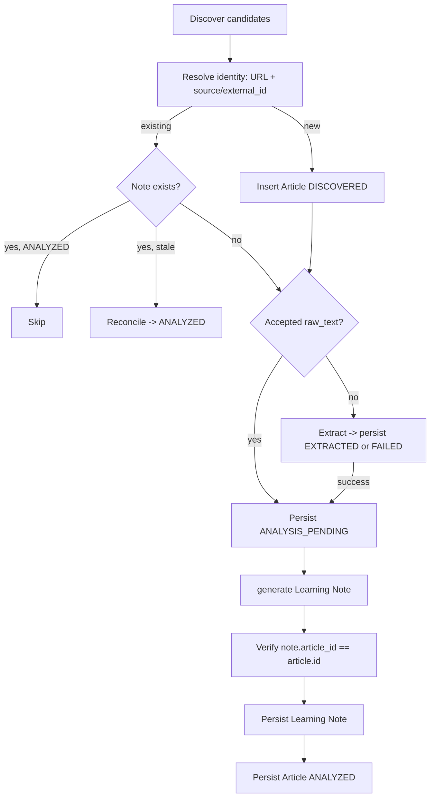
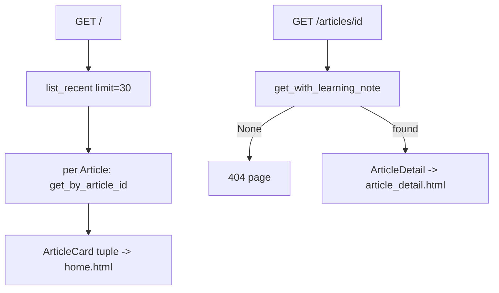

# ARCHITECTURE.md

# CurrentMind Architecture Overview

This document describes the Phase 1 system at a structural level. It is
deliberately concise and system-level; it is **not** a class-by-class API
reference. For the reasoning behind each decision, see the corresponding ADR
in `docs/DECISIONS.md` (cross-referenced throughout).

CurrentMind is a modular monolith (ADR-003) with a strict layer ordering:

```text
Presentation  ->  Application  ->  Domain
       \              |
        \             v
         ------>  Infrastructure  (implements application ports)
```

Dependencies point inward. The domain layer depends on nothing external; the
application layer depends only on the domain and on its own ports; the
infrastructure and presentation layers depend inward and supply concrete
adapters.

---

## 1. Domain layer (`app/domain/`)

Pure, framework-free Pydantic v2 models and validation helpers (ADR-017).
Contains no web framework, ORM, LLM SDK (neither OpenAI nor Anthropic), feed
parser, extraction library, or HTTP code.

* `ArticleCandidate` — a source-neutral discovered article, pre-persistence.
* `Article` — a persisted article with a `processing_status`
  (`ProcessingStatus`) and a coordinated `failure_reason` invariant
  (`FAILED` requires a reason; every other status forbids one).
* `ExtractedArticle` / `ExtractionStatus` — the result contract of extraction.
* `LearningNote`, `LearningNoteContent`, `PrelimsQuestion`, `MainsQuestion`,
  `GSPaper` — the structured study output. `LearningNoteContent` is the
  AI-authored subset; trusted metadata (`id`, `article_id`, `model_name`,
  `prompt_version`, `created_at`) lives only on `LearningNote` (ADR-022).

All timestamps are timezone-aware UTC; URLs are validated as absolute
http(s).

## 2. Application layer (`app/application/`)

Defines ports (`Protocol`s) and orchestration services; imports no
infrastructure framework.

**Ports**

* `ArticleSource.discover_articles()` (`sources.py`) — raises
  `ArticleSourceError` on total discovery failure.
* `ArticleExtractor.extract(url)` (`extraction.py`) — returns an
  `ExtractedArticle` for every operational outcome; raises `ValueError` only
  for a structurally invalid URL (ADR-020).
* `ArticleRepository` / `LearningNoteRepository` (`repositories.py`) — plus
  `ArticleWithLearningNote` and the `RepositoryError` hierarchy
  (`DuplicateArticleError`, `DuplicateLearningNoteError`,
  `RelatedArticleNotFoundError`) (ADR-021).
* `LearningNoteGenerator.generate(article)` (`learning_notes.py`) — plus the
  `LearningNoteProviderError` / `LearningNoteValidationError` errors and the
  pure `assemble_learning_note()` (ADR-022).
* `DashboardQuery` (`dashboard.py`) — the read-only query surface for the
  dashboard (ADR-024).

**Services**

* `ProcessNewsFeedService` (`processing.py`) — the synchronous, idempotent
  pipeline (ADR-023): `process(retry_failed=False)` and
  `retry_article(article_id)`, plus `ProcessingSummary`,
  `ArticleProcessingResult`, `FailureDetail`, `PipelineStage`, the
  `reconstruct_article()` transition helper, and `new_article_from_candidate()`.
* `DashboardQueryService` (`dashboard.py`) — builds the immutable `ArticleCard`
  and `ArticleDetail` read models from the repository ports; performs no
  writes and never touches the pipeline.

## 3. Infrastructure layer (`app/infrastructure/`)

Concrete adapters, the only place external SDKs are imported.

* `IndianExpressRSSSource` (`rss_source.py`) — `httpx` + `feedparser`.
* `TrafilaturaArticleExtractor` (`trafilatura_extractor.py`) — `httpx` +
  Trafilatura.
* `SQLiteArticleRepository` / `SQLiteLearningNoteRepository`
  (`sqlite_repositories.py`) — SQLAlchemy 2.x over SQLite; `orm_models.py`,
  `mappers.py`, `database.py` provide the ORM rows, explicit domain/ORM
  mapping, and engine/session factory.
* `OpenAILearningNoteGenerator` (`openai_generator.py`) — the OpenAI Responses
  API adapter — and `AnthropicLearningNoteGenerator` (`anthropic_generator.py`)
  — the Anthropic Messages API adapter (ADR-026). Both implement the single
  `LearningNoteGenerator` port and share the source-neutral v1 prompts
  (`prompt_loader.py` loads the versioned templates); provider selection
  happens only in the CLI composition root, never in the domain or application
  layers.
* `config.py` (`Settings`), `logging.py`.

## 4. Presentation layer (`app/presentation/`)

* `api.py` — the `create_app()` FastAPI factory: `/health`, the read-only
  dashboard routes (`GET /`, `GET /articles/{article_id}`), Jinja2 templates,
  and the static mount (ADR-024).
* `view_helpers.py`, `templates/`, `static/dashboard.css`.

`app/cli.py` is the processing composition root and stdlib-`argparse` entry
point; `main.py` builds the FastAPI app for `uvicorn`.

---

## 5. Configuration flow

`Settings` (`config.py`, pydantic-settings) reads seven environment variables
(optionally from `.env`): `LLM_PROVIDER`, `OPENAI_API_KEY`, `ANTHROPIC_API_KEY`,
`DATABASE_URL`, `RSS_URL`, `LOG_LEVEL`, `LLM_MODEL`. `LLM_PROVIDER` defaults to
`openai` and is normalized (whitespace-trimmed, lower-cased) at composition. The
CLI composition root selects the provider and validates its processing-only
requirements up front: `LLM_MODEL` plus the selected provider's key — only
`OPENAI_API_KEY` for `openai`, only `ANTHROPIC_API_KEY` for `anthropic` (the
other provider's key is not required); an unknown provider is rejected with a
safe error. The dashboard needs only `DATABASE_URL`. Nothing opens a database
connection at import time; the engine connects lazily on first read.

## 6. Processing flow



Ground-truth reconciliation drives resumption: a persisted Learning Note and
non-blank accepted `raw_text` decide the stage, never a possibly-stale status
and never by parsing `failure_reason`. One candidate's failure never stops the
batch; failures are reported as safe `FailureDetail`s (ADR-023).

## 7. Dashboard read flow



The home page issues one `list_recent` plus one note lookup per Article
(`1 + N`, N ≤ 30). All reads are display-safe read models that never carry
`raw_text` (ADR-024).

## 8. Persistence model and transaction boundaries

SQLite via SQLAlchemy 2.x, schema owned solely by Alembic (revision
`3318676bf824`); there is no `create_all()` path. Each repository method opens
its own session and owns its own transaction — **one transaction per method,
no Unit of Work** (ADR-021, ADR-023). Cross-run deduplication is enforced by
named unique constraints (`uq_articles_url`,
`uq_articles_source_external_id`, `uq_learning_notes_article_id`), which are
the final duplicate boundary.

## 9. Note-first finalization and reconciliation

Analysis always persists the Learning Note **before** marking the Article
`ANALYZED`, so `ANALYZED` can never durably exist without its note. If
finalization fails after the note is durable, the Article rests at
`ANALYSIS_PENDING`; the next run's note-existence reconciliation finalizes it
without regenerating. This deliberate ordering plus idempotent reconciliation
replaces a Unit of Work (ADR-023).

## 10. Error and privacy boundaries

* Extraction and analysis failures are persisted as fixed, safe
  `failure_reason` strings (`extraction: …`, `analysis: …`, `persistence: …`).
* `FailureDetail` messages and logs carry only identifiers, fixed categories,
  and exception **type names** — never article text, prompts, provider
  output, API keys, SQL, database URLs, `str(exc)`/`repr(exc)`, or URL query
  tokens. The engine uses `hide_parameters=True`.
* CLI exit code is `0` only for a clean run; `1` for configuration,
  discovery, lookup, database, or per-article failures. Dashboard errors:
  malformed UUID → 422, absent Article → 404, `RepositoryError` → fixed 503.
* Dashboard templates autoescape all stored content (no `|safe`).

## 11. Testing strategy

Every automated test is external-service-free (ADR-012, ADR-025): no live
RSS, Article page, OpenAI, or Anthropic call, and no development database.
Fakes implement the application `Protocol`s and the narrow provider-SDK seams
structurally — `tests/application/processing_fakes.py`, and the handwritten
OpenAI and Anthropic SDK-boundary fakes
(`tests/infrastructure/openai_fakes.py`, `tests/infrastructure/anthropic_fakes.py`).
The **real** generator adapters run against those fakes (never a fake
`LearningNoteGenerator`), and provider selection in the composition root is
tested offline in `tests/test_cli_composition.py` (with dotenv loading disabled
so no local `.env` can influence the result). Real repository adapters are
exercised against real SQLite under a temporary Alembic migration
(`tests/infrastructure/*_end_to_end.py`, `conftest.py`), which also serves as
the persistence-across-reopen (restart-equivalent) coverage. Only the external
network/LLM boundary is ever replaced.
